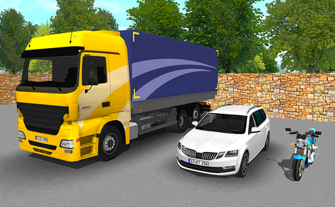
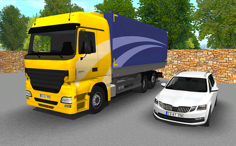

# 1.1. A jármű és a vezetője

Ebben a modulban megismerkedhetsz:
- az elméleti és gyakorlati vizsgákkal kapcsolatos tudnivalókkal,
- a jogosítvány kiváltásához szükséges tennivalókkal,
- a járművezetés személyi feltételeivel és a szükséges iratokkal,
- a jármű közlekedésben való részvételének egyes feltételeivel.

## A közúti közlekedés és a járművek

Életünk szerves része a közlekedés. Az emberek munkába vagy iskolába járnak, vásárolni vagy szórakozni mennek, meglátogatják a rokonaikat és az ismerőseiket. Bár közlekedni lehet sínen, vízen és a levegőben is, a legtöbb helyváltoztatás mégis közúton történik. A **közúti közlekedésnek** számos formája van. Lehet gyalogolni vagy kerékpározni, igénybe lehet venni a közösségi közlekedést, de akár autót vezetve is haladhatsz az utakon.

A most megkezdett képzéseddel éppen arra készülsz fel, hogy ezt is megtehesd.

A **gépjármű** olyan jármű, amelyet **beépített erőgép hajt**.

Bár beépített erőgép hajtja, mégsem minősül gépjárműnek:
- a mezőgazdasági vontató (traktor),
- a lassú jármű,
- a segédmotoros kerékpár és
- a villamos.

A **gépkocsi** olyan **gépjármű**, amelynek **négy vagy több kereke van**, a négykerekű motorkerékpár (pl. quad) azonban nem gépkocsi.

**Kerékpár**: olyan, legalább kétkerekű jármű, amelyet emberi erő hajt, és ezt legfeljebb 300 W teljesítményű motor segíti.
**Kézikocsi**: olyan, legalább kétkerekű teherszállító eszköz, amelyet a vezető húz vagy tol.
**Lassú jármű**: olyan, meghajtással rendelkező jármű, amely kialakításánál fogva nem képes sík úton önerejéből 25 km/h sebességnél gyorsabban haladni.
**Segédmotoros kerékpár**, más néven robogó, moped: olyan, leggyakrabban kétkerekű jármű, amelynek a motorja legfeljebb 50 cm³ hengerűrtartalmú vagy 4 kW teljesítményű. (Megjelenése jellemzően: kisebb motorkerékpár, amelynek nincs rendszáma.)
**Motorkerékpár**: kis, közepes, vagy nagy teljesítményű kétkerekű, oldalkocsi nélküli vagy oldalkocsis gépjármű, továbbá a motoros tricikli.
**Pótkocsi**, más néven utánfutó: olyan jármű, amely gépjárművel, mezőgazdasági vontatóval vagy lassú járművel történő vontatásra készült.
**Járműszerelvény**: vontatóból és (fél)pótkocsiból álló járműegység.
**Félpótkocsi**: olyan pótkocsi, amely nagymértékben a vontatóra támaszkodik. A köznyelvben kamionnal nevezett járműszerelvények hátsó része a félpótkocsi, amit egy nyerges vontató húz.

Sikeres vizsgáiddal **"B" kategóriás vezetői engedélyt** fogsz szerezni. Ez olyan **gépkocsik vezetésére** jogosít fel, amelyek legfeljebb **3500 kg megengedett legnagyobb össztömegűek** és (vezetővel együtt) **maximum 9 fő szállítására alkalmasak**. Bizonyos feltételekkel pótkocsit is vontathatsz majd, és más vezetési jogosultságokat is kapsz (pl. segédmotoros kerékpárokra). Ezekkel a későbbiekben részletesen is megismerkedsz.

## A képzés és a vizsgák

A "B" kategóriás vezetői engedély megszerzésének feltétele
- az **egészségi alkalmasság**,
- az **alapfokú iskolai végzettség**,
- az **elméleti tanfolyam elvégzése**,
- a sikeres **elméleti vizsga**,
- a **gyakorlati oktatás** feltételeinek teljesítése,
- a sikeres **gyakorlati vizsga**,
- az **"elsősegélynyújtási ismeretek"** megszerzése, illetve megléte,
- a **betöltött 17. életév**.

Az elméleti tanfolyam **akkreditált e-learning tananyag** elvégzésével is teljesíthető.

Középiskolai járművezető képzés keretében az alapfokú iskolai végzettséget nem kell külön igazolni.

**Elméleti vizsgára** legkorábban **16 év és 9 hónapos életkor betöltése** esetén kerülhet sor, míg a **gyakorlati vizsga** kizárólag a **17. életév betöltése után** lehetséges (köznevelési, illetve szakképzési intézményben végzett képzés esetén az életkori feltételek ettől eltérhetnek).

Az elméleti tanfolyam sikeres elvégzését egy **"Képzési igazolás"** (tanfolyam-igazolás) jelenti, amit a tananyag lezárását követően a képzésmenedzsment-rendszer automatikusan állít ki és elküldi a vizsgaközpont részére. Ez az elméleti vizsgára történő jelentkezésed egyik feltétele.

> **Autósiskolai képzés** esetén a **tanfolyam megkezdésétől** (a tananyag első indításától) számított **9 hónapon belül** az **első vizsgaeseménynek** meg kell történnie, valamint **12 hónapon belül sikeres elméleti vizsgát** kell tenni. **Középiskolai járművezetői képzés** esetén a **sikeres jelentkezést követő 12 hónapon belül** kell **sikeres vizsgát** tenned.

Ha bármelyik határidőt **elmulasztod, meg kell ismételned** az elméleti képzést.

Ha **autósiskolában tanulsz, az **első vizsgaeseményre az iskolán keresztül** kell **jelentkezned**. Az esetleses pótvizsgákra is jelentkezhetsz a képzőszerven keresztül, de azt már akár te is megteheted személyesen, a számítógépes elméleti vizsga helyszínén.

**Középiskolában** tanulva a vizsgára **a tanulmányi rendszeren keresztül tudsz jelentkezni**.

Az elméleti vizsga számítógépes programmal történik a vizsgaközpont vagy a középiskola szervezésében. (Ha hallássérült vagy, esetleg olvasási nehézségeid vannak, akkor a szervezőknél érdeklődj a további lehetőségekről.)

A "Közlekedési alapismeretek" tantárgyból **55 kérdéses számítógépes, feleletválasztós tesztet** kell **55 perc alatt** teljesíteni. A maximális pontszám 75, amiből a **sikeres** vizsgaeredményhez **legalább 65 pontot** kell elérni.

Csak a sikeres elméleti vizsga birtokában kezdhető meg a gyakorlati képzés. A **gyakorlati oktatással** kapcsolatos tudnivalók:
- egy gyakorlati óra tervezetten **50 perc** időtartamú,
- kötelező **minimális óraszám: 29 óra** (29 x 50 perc),
- teljesítendő **minimális menettávolság: 580 km**.

A **forgalmi vizsgával** kapcsolat tudnivalók:
- a **teljes vizsgaidő: 60 perc**,
- ebből a **közúti vezetés** ideje: **50 perc**.

> A **sikeres elméleti vizsgától számított két éven belül sikeres forgalmi vizsgát** kell tenni, ellenkező esetben az egész (elméleti és gyakorlati) tanfolyamot meg kell ismételni.

## A jogosítvány kiváltása

A vezetői engedély megszerzésének **alapvető feltétele**, hogy a jelölt **sikeres elméleti és gyakorlati vizsgát** tegyen járművezetésből.

### Személyes igénylés

A sikeres forgalmi vizsgát követően (célszerűen legalább 2-3 munkanappal később) a jogosítvány kiváltása bármely **kormányablakban vagy okmányirodában** kezdeményezhető.

Az ügyintézéshez vinni kell a **személyes iratokat** (személyi igazolvány, lakcímkártya, esetleg korábbról meglévő vezetői engedély), és szükséged lehet még az alábbiakra is (ha azok nem érhetők el a nyilvántartásokból az ügyintéző számára elektronikusan):
- a sikeres **elsősegélynyújtó vizsgáról** szóló **igazolás** (első vezetői engedély megszerzése esetén),
- az **egészségi alkalmassági vélemény** (ha az alkalmasságot nem a már meglévő vezetői engedélyeddel igazolod).

Az elkészült engedélyt néhány héten belül kipostázzák a megadott lakcímre, de természetesen választhatsz személyes átvételi módot is. Belföldön addig is (de legfeljebb 30 napig) vezethetsz a kiállítási kérelem benyújtásakor kapott adatlappal.

### Automatikus kiállítás

Lehetőség van a vezetői engedély automatikus kiállítására is, az alábbi feltételek teljesülése mellett:
- Megteszed az **automatikus kiállítás igénylésére vonatkozó nyilatkozatot** (ha ezt nem tetted meg a tanfolyami beiratkozásod során, akkor még most vagy akár később is elvégezheted az autósiskolád segítségével vagy a megfelelő elektronikus ügyintézésre történő ügyfélkapus bejelentkezéssel).
- Rendelkezel **magyarországi szokásos tartózkodási hellyel**.
- **Sikeres elsősegélynyújtó vizsgát** tettél, vagy végzettséged alapján mentességi igazolással rendelkezel (ezekre csak az első vezetői engedély kiállításához van szükség).
- Rendelkezel **orvosi egészségi alkalmassági igazolással**, vagy meglévő vezetői engedélyed igazolja az egészségi alkalmasságodat.
- Van 3 évnél nem régebbi, okmánykiállításhoz alkalmas **digitális fénykép- és aláírásadatod** a személyiadat- és lakcímnyilvántartásodban (ha nincs, akkor az ma már akár otthonról is intézhető videotechnológiával).

Ebben az esetben a **sikeres forgalmi vizsga után automatikusan megkapod** a jogosítványt a levelezési címedre. Belföldön viszont már attól a pillanattól tudsz vezetni, hogy a vezetési jogosultságodat bejegyezték az engedély-nyilvántartásba. Az eljárásban azért érdemes megadni a mobilszámod vagy e-mail címed, mert erről még értesítést is kapsz. A további tudnivalókról [itt](https://magyarorszag.hu/szuf_szolg_lista?kategoria=OK.VE) tájékozódhatsz.

> Az **első vezetői engedély kiállítása** bármelyik ügyintézési mód esetén **ingyenes**, míg az **okmány cseréje** (pl. kategóriabővítés esetén) már **csak az automatikus kiállítási eljárásban illetékmentes**.

## A sikeres vizsgán túl

A **jogosítvány megszerzése** azt jelenti majd, hogy elsajátítottad a jármű kezelését, a közlekedés alapelveit és szabályait, valamint azok alkalmazását a gyakorlatban. Eredményes vizsgáid alapján alkalmasnak találtak arra, hogy a kategóriának megfelelő járműveket vezetve **részt vegyél a közúti közlekedésben**. Ekkor már a mindennapi közlekedésben előforduló **különféle szituációkat kell önállóan** (szakoktatód támogatása nélkül), **sikeresen és biztonságosan megoldanod**.

A megfelelő gyakorlat megszerzéséhez, azaz a **tudatos járművezetői készségek és gondolkozásmód,** a **közlekedési előrelátás** és a **helyes közlekedési szemlélet kialakulásához** (különösen első jogosítvány esetén) viszont még nagyon sok önállóan levezetett kilométer kell. A szakemberek véleménye szerint a kellő **rutin megszerzéséhez** körülbelül **100 ezer kilométer megtétele** szükséges. Ezért fontos, hogy a kezdeti időszakban óvatos és türelmes légy, reálisan mérd fel a képességeidet, gyűjtsd és rendszerezd a tapasztalataidat. Jó, ha folyamatosan, rendszeresen vezetsz. Ha pedig hosszabb kihagyásra kényszerülsz, akkor hasznos lehet néhány tudásfelfrissítő órát venni egy autósiskolában.

A **rendkívüli helyzetek** helyes kezelésére és **megoldására** ajánlott **külön is készülni**. A megfelelő technikákat érdemes
- speciális **vezetéstechnikai tréning** vagy
- **szimulátoros oktatás**
keretében elsajátítani

## Személyi feltételek

A **vezető** az a személy, aki az **úton járművet vezet vagy állatot hajt** (vezet). A segédmotoros kerékpárt és a kerékpárt toló személy nem minősül vezetőnek.

A járművezetés személyi feltételeit a KRESZ pontosan meghatározza. **Járművet** olyan személy **vezethet**, aki
- az adott jármű vezetésére jogszabályban meghatározott, **érvényes vezetői engedéllyel vagy az engedély-nyilvántartásba bejegyzett érvényes vezetési jogosultsággal rendelkezik** (a magyar hatóság által kiállított vezetői engedélyt belföldön vezetés közben nem kötelező magadnál tartani), és a jármű vezetésétől **nincs eltiltva**,
- a jármű **biztonságos vezetésére képes** állapotban van,
- **nem áll** a vezetési képességre **hátrányosan ható szer** (pl. drog, bizonyos gyógyszerek stb.) **befolyása alatt**, és **szervezetében nincs szeszes ital** fogyasztásából származó alkohol.

**Nem engedheted át a jármű vezetését** olyan személynek, akinek a **szervezetében** szeszes ital fogyasztásából származó **alkohol mutatható ki**. Ez akkor is igaz, ha az illető érvényes vezetői engedéllyel rendelkezik.

> **A jármű tulajdonosaként vagy üzemben tartójaként te felelsz azért, hogy autódat csak olyan személy vezesse, aki megfelel a járművezetés feltételeinek** (azaz rendelkezik érvényes vezetői engedéllyel, nem ittas, stb.). A Büntető Törvénykönyv alapján a felelősség téged is terhel, ha ezt figyelmen kívül hagyod.

## A megfelelő ruházat

**Szűk, kényelmetlen ruhában** vagy télen nagykabátban, zárt sapkában az ember **mozgása korlátozott**.

A **magas sarkú cipő, a strand- vagy vászonpapucs** nem tartja elég stabilan a lábat, használatuk **balesetveszélyes** helyzetbe is sodorhat. Ugyanígy nem alkalmas a vezetéshez a bakancs sem vagy bármely olyan cipő, amelyben nem tudod kényelmesen mozgatni a lábfejed.

Törekedj arra, hogy vezetés közben lehetőség szerint **kényelmes, réteges ruházatot viselj**.

**Zárt cipőben** vezess, **aminek a talpa** kemény, **vékony és lapos**. Ez segíti az aktív kontaktust a pedálokkal, és rajtuk keresztül az autóval.

## Az alkoholfogyasztás

Az alkohol hatására a **reakcióidő meghosszabbodik**, emellett megnő a felelőtlen, hibás döntések száma és a hajlandóság a kockázatvállalásra.

Vezetés közben a **reakcióidő** (az észleléstől a cselekvésig, pl. a fékpedál megérintéséig eltelt idő) **átlagosan 0,5-0,7 másodperc**. Amennyiben a járművezető szervezetében - akár csak kis mennyiségű - alkohol található, ez az érték **2-6 másodpercre növekedhet**.

> **Csak abban az esetben vezess autót, ha arra a szabályok és saját megítélésed szerint is alkalmas vagy!

Egy átlagos emberi szervezet **egy óra alatt 0,1 ezrelék véralkohol lebontására** képes. Ezt semmilyen módon **nem lehet gyorsítani** (nem számít a sétálás, kávéfogyasztás, jó levegő sem). Egy sör akár 0,3 ezrelékes véralkoholszintet is eredményezhet, tehát 3 óra is szükséges lehet a lebontásához.

> Magyarországon **zéró tolerancia** van érvényben: gépjármű vezetésekor a megengedett alkoholkoncentráció a vezető szervezetében: 0.

Az ittas állapotban történő járművezetés
- **0,50** gramm/liter **véralkohol-koncentráció** vagy
- **0,25** miligramm/liter **levegőalkohol-koncentráció
**felett bűncselekmény**.

Az alkoholfogyasztás tilalma **nem vonatkozik a kerékpárral közlekedőkre, feltéve, hogy** a kerékpáros **a jármű biztonságos vezetésére képes állapotban van**. Emellett természetesen tilos más közlekedők veszélyeztetése, és továbbra is elvárás a fokozott óvatosság!

## A járművezetéshez szükséges iratok

Magyarországon a **vezetésre jogosító okmányok** a következők:
- vezetői engedély,
- nemzetközi vezetői engedély.

A magyar hatóság által kiállított **vezetői engedélyt belföldön nem kötelező a vezetőnek magánál tartania** vezetés közben. Azonban személyazonosító igazolványod vagy más, **személyazonosításra alkalmas okmányod** ebben az esetben **legyen nálad**. (Ugyanakkor érdemes tudni, hogy az érvényes vezetői engedély belföldön alkalmas a személyazonosság igazolására is.)

A vezetői engedélyt **cserélni** kell, **ha változás történik**:
- a vezetői engedély **adataiban** (személyi adatok, név),
- az **orvosi érvényességben**,
- a **kategóriában** (bővítés, lemondás).

## Forgalmi engedély és törzskönyv

### Forgalmi engedély

A forgalmi engedély **közokirat**, ami azt **igazolja**, hogy műszaki érvényesség esetén a **jármű jogosult a közúti forgalomban részt venni**.

A jármű forgalmi engedélyének **külföldön mindig nálad kell lennie** autóvezetés közben, ugyanakkor belföldön a magyar hatóság által kiállított forgalmi engedélyt nem kötelező a vezetőnek magánál tartania vezetés közben.

A lejáró **műszaki érvényességi idő** meghosszabbítása érdekében a járművet időszakos vizsgálatra (műszaki vizsga) kell vinni. Az időszakos vizsgálatot a közlekedési hatóság vagy az általa engedélyezett gépjárműfenntartó szervezet (szerviz, javítóműhely) vizsgálóállomása végezheti.

> Az üzemben tartó **köteles** a gépjárműre **felelősségbiztosítási szerződést kötni**, és azt díjfizetéssel hatályban tartani.

A **jármű üzemben tartója** gyakorolja a jármű használatával és forgalomban tartásával kapcsolatos jogokat, valamint felelős az azzal kapcsolatos kötelezettségek teljesítéséért. Az üzemben tartó személye alapesetben megegyezik a **jármű tulajdonosával**, de tulajdonos másra is átruházhatja az üzembentartói jogokat.

### Törzskönyv

A törzskönyv a jármű **tulajdonjogát igazoló okirat**. Egy járműhöz egy időben csak egy érvényes törzskönyv tartozhat. A közlekedési igazgatási hatóság adja ki a törzskönyvet a jármű első forgalomba helyezése során annak, aki a jármű tulajdonjogát igazolja.

**Új törzskönyvet** kell kiállítani
- a jármű **átadásakor** (adásvétel), továbbá
- a jármű vagy a tulajdonos adatainak, valamint a törzskönyvben feltüntetett bármely más **adatnak a változásakor**.

A korábbi törzskönyvet a közlekedési igazgatási hatóság visszavonja, érvényteleníti.

> A **törzskönyvet sohase tartsd a járműben**, mert annak eltulajdonítása esetén ezzel tudod bizonyítani azt, hogy a jármű a te tulajdonod.

## Környezetvédelmi és műszaki megfelelőség

A járművek műszaki és környezetvédelmi megfelelőségét a **forgalomba helyezés előtt és az időszakos vizsgálat** keretén belül is ellenőrzik.

Ha az időszakos vizsgálaton a **jármű nem felel meg**, akkor a hatóság **nem hosszabbítja meg** a **forgalmi engedély** érvényességének **időbeli hatályát**.

A járművet típusjellemzői alapján **környezetvédelmi osztályba** sorolják, amit a jármű forgalmi engedélyének V.9 rovatában fel is tüntetnek.

A **környezet védelméhez** hozzájárulhatsz
- a járműved rendszeres **karbantartásával** és
- az üzemanyag-takarékos **járművezetéssel** is.